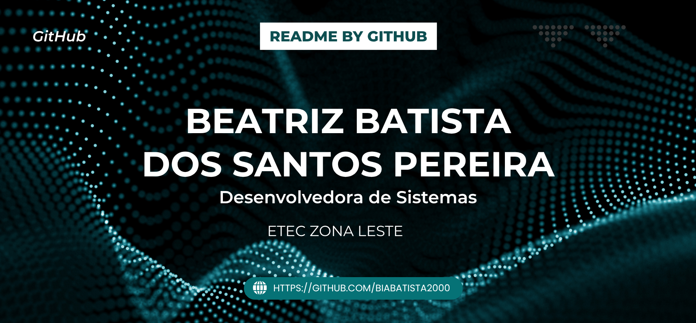

# Oi, eu sou a Beatriz Batista 👋

🎓 Estudante de Desenvolvimento de Sistemas na ETEC Zona Leste

💻 Tenho interesse em desenvolvimento web com Laravel, aplicativos mobile, banco de dados e redes de computadores.

📍 Atualmente estou desenvolvendo aplicativos mobile, criando aplicações web integradas a bancos de dados e aprofundando meus conhecimentos em redes utilizando as tecnologias da Cisco.

🚀 Sempre buscando aprender novas tecnologias e aplicar esse conhecimento em projetos práticos.

---

## Sobre mim

Meu interesse por tecnologia começou durante o curso de Desenvolvimento de Sistemas na ETEC Zona Leste. Foi lá que tive meus primeiros contatos com programação, desenvolvimento web e banco de dados, áreas que despertaram minha curiosidade e motivaram minha busca constante por aprendizado.

Atualmente, concentro meus estudos no desenvolvimento de aplicações web com Laravel, na criação de aplicativos mobile, na modelagem e gerenciamento de bancos de dados e em redes de computadores utilizando as ferramentas e conteúdos da Cisco.

Busco evoluir continuamente através de projetos práticos, desafios e novas experiências que me permitam ampliar meus conhecimentos e desenvolver minhas habilidades técnicas.

---

## Tecnologias que utilizo

---

## Atualmente estudando

* Laravel
* Java
* MySQL
* Desenvolvimento Mobile
* Redes de Computadores (Cisco)
